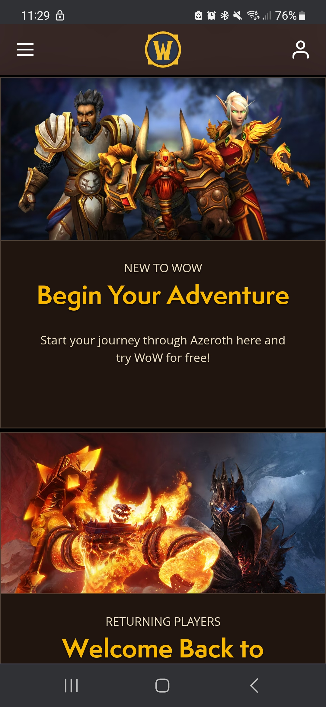
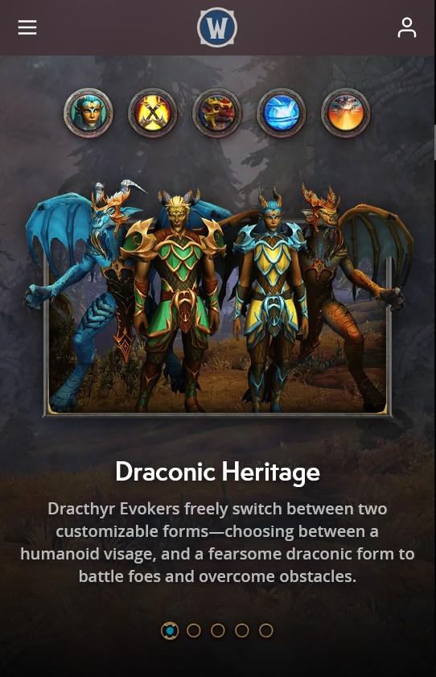
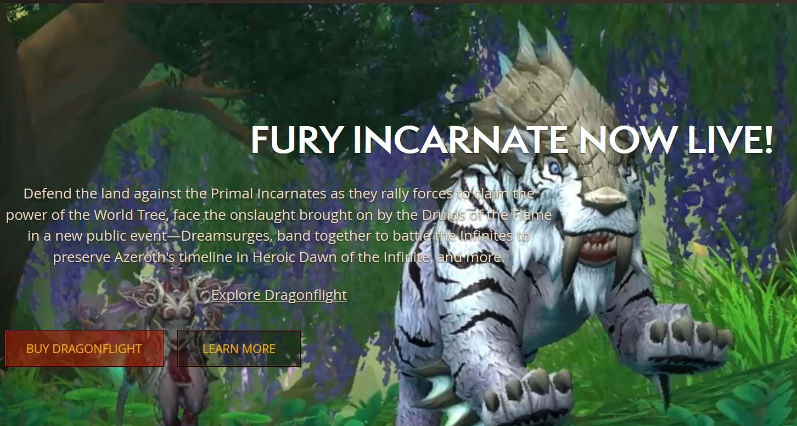
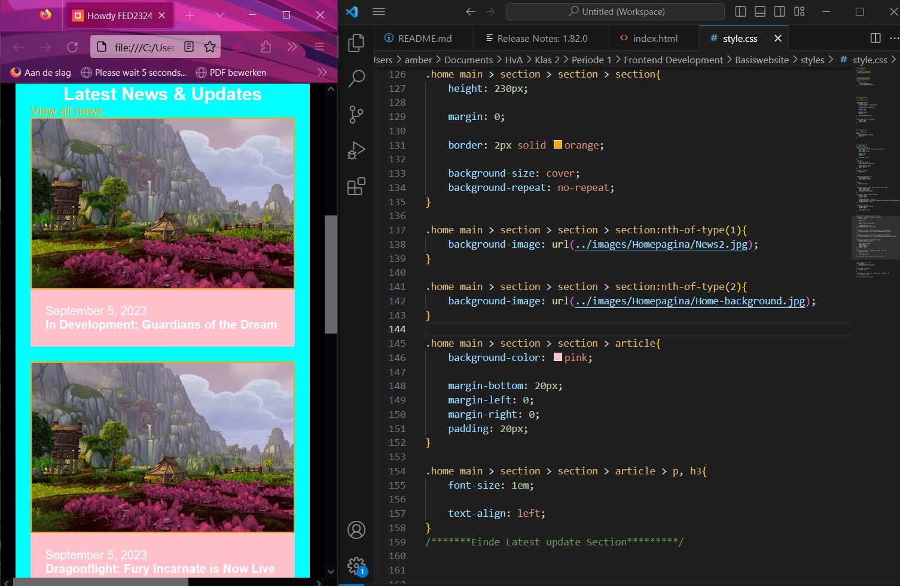
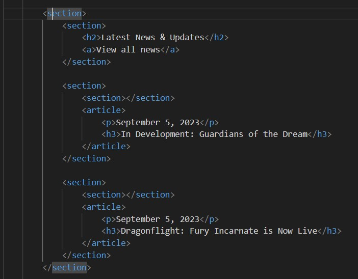

# Procesverslag
Markdown is een simpele manier om HTML te schrijven.  
Markdown cheat cheet: [Hulp bij het schrijven van Markdown](https://github.com/adam-p/markdown-here/wiki/Markdown-Cheatsheet).

Nb. De standaardstructuur en de spartaanse opmaak van de README.md zijn helemaal prima. Het gaat om de inhoud van je procesverslag. Besteedt de tijd voor pracht en praal aan je website.

Nb. Door *open* toe te voegen aan een *details* element kun je deze standaard open zetten. Fijn om dat steeds voor de relevante stuk(ken) te doen.

## Jij

  
uitwerken voor kick-off werkgroep

  ### Auteur:
  Amber Venema

  #### Je startniveau:
  Rode piste

  #### Je focus:
  Surface plane
 

## Je website

  
uitwerken voor kick-off werkgroep

  ### Je opdracht:
  World of Warcraft website: https://worldofwarcraft.blizzard.com/en-us/

  Informatie website over de game World of Warcraft

  #### Screenshot(s) van de eerste pagina (small screen): 
  Homepagina
  https://worldofwarcraft.blizzard.com/en-us/ 

  

  #### Screenshot(s) van de tweede pagina (small screen):
  Dragonflight expansion
  https://dragonflight.blizzard.com/en-us/
  
  
 

## Toegankelijkheidstest 1/2 (week 1)

  
uitwerken na test in 2e werkgroep

  ### Bevindingen
  Lijst met je bevindingen die in de test naar voren kwamen:

  Ik had verwacht dat de webstie toegankelijk zou zijn en dat was het eigenlijk helemaal niet. Je kan niet inzoomen, er worden geen alt-teksten gebruikt, er is geen button om meteen naar de content toe te gaan en de screenreader slaat sommige elementen over en spreekt het niet correct uit. Terwijl er wel lang="en-US" staat, maar sommige woorden worden als nog half nederlands gesproken in een engels accent.
  Verder wordt er op de home pagina een video gebruikt met flitsende beelden. Je kan het ook totaal niet uitzetten.

  Visueel ziet de website er mooi uit, maar als je een beperking hebt, ga je veel moeite hebben met het begrijpen van deze website. Zoals dat er geen focus staat op de knoppen, dus dan weet de screenreader ook niet waar je heen gaat of waar je op staat.
  Of het lezen van tekst op een afbeelding of video. Het contrast ervan is erg slecht en het leid ook nog eens af. Als je slecht zient bent, kun je dat niet goed lezen en inzoomen kan niet.

  Zoals hier:

   

## Breakdownschets (week 1)

  
uitwerken na afloop 3e werkgroep

  De website bevat heel veel div's in elkaar. Dat heb ik nu niet allemaal genoteerd, want dan zou het helemaal vol zitten met aantekeningen. Voor mijn website wil ik minder sections gaan gebruiken. Minstens twee of drie in elkaar. 

  ### de hele pagina van Homepagina: 
  

   ### de hele pagina van Dragonflight: 
  

## Voortgang 1 (week 2)

  
uitwerken voor 1e voortgang

  ### Stand van zaken
  hier dit ging goed & dit was lastig (neem ook screenshots op van delen van je website en code)

  Ik heb een begin van de home pagina gemaakt, maar nog niet zoveel. In en buiten de les was ik vooral bezig met de opdrachten in de werkgroep. Daardoor ben ik wat later begonnen aan mijn webstie.

  Op het moment zit ik vast met de selectors. Ik heb een aantal sections gemaakt en het lukt mij niet om een bepaalde selector aan te roepen. Dan maakte ik gebruik van :nth-of-type() en werd er eigenlijk alleen de eerste section die er is. Of om de 2 sections.

  Hier is een voorbeeld:

  Twee section hebben dezelfde achtergrond foto, terwijl ik hier een pad heb gemaakt om ze uitelkaar te halen. Er moet iets zijn dat ik niet goed heb ingetikt, maar ik zie even niet wat.

  

  Dit is de html ervan. De section die ik probeer te pakken, is een section in een section in een section. 

  
  

  ### Agenda voor meeting
  samen met je groepje opstellen

  | Amber          | Elles              | Rhania       | Sophie           |
  | ---            | ---                | ---          | ---              |
  | Tekst schalen  | Tekst schalen      | Flexbox      | Flexbox          |
  | CSS Selectors  | Grid               |              | Responsive       |
  |                | Logo in het midden |              |                  |

  ### Verslag van meeting
  hier na afloop snel de uitkomsten van de meeting vastleggen

  - punt 1
  - punt 2
  - nog een punt
  - ...

## Voortgang 2 (week 3)

  
uitwerken voor 2e voortgang

  ### Stand van zaken
  hier dit ging goed & dit was lastig (neem ook screenshots op van delen van je website en code)

  ### Agenda voor meeting
  samen met je groepje opstellen

  | student 1      | student 2          | student 3    | student 4        |
  | ---            | ---                | ---          | ---              |
  | dit bespreken  | en dit             | en ik dit    | en dan ik dat    |
  | en dat ook nog | dit als er tijd is | nog een punt | dit wil ik zeker |
  | ...            | ...                | ...          | ...              |

  ### Verslag van meeting
  hier na afloop snel de uitkomsten van de meeting vastleggen

  - punt 1
  - punt 2
  - nog een punt
- ...

## Toegankelijkheidstest 2/2 (week 4)

  
uitwerken na test in 9e werkgroep

  ### Bevindingen
  Lijst met je bevindingen die in de test naar voren kwamen (geef ook aan wat er verbeterd is):

## Voortgang 3 (week 4)

  
uitwerken voor 3e voortgang

  ### Stand van zaken
  hier dit ging goed & dit was lastig (neem ook screenshots op van delen van je website en code)

  ### Agenda voor meeting
  samen met je groepje opstellen

  | student 1      | student 2          | student 3    | student 4        |
  | ---            | ---                | ---          | ---              |
  | dit bespreken  | en dit             | en ik dit    | en dan ik dat    |
  | en dat ook nog | dit als er tijd is | nog een punt | dit wil ik zeker |
  | ...            | ...                | ...          | ...              |

  ### Verslag van meeting
  hier na afloop snel de uitkomsten van de meeting vastleggen

  - punt 1
  - punt 2
  - nog een punt
  - ...

## Eindgesprek (week 5)

  
uitwerken voor eindgesprek

  ### Je uitkomst - karakteristiek screenshots:
  

  ### Dit ging goed/Heb ik geleerd: 
  Korte omschrijving met plaatjes

  

  ### Dit was lastig/Is niet gelukt:
  Korte omschrijving met plaatjes

  

## Bronnenlijst

  
continu bijhouden terwijl je werkt

  Nb. Wees specifiek ('css-tricks' als bron is bijv. niet specifiek genoeg). 
  Nb. ChatGpT en andere AI horen er ook bij.
  Nb. Vermeld de bronnen ook in je code.

  1. bron 1
  2. bron 2
  3. ...

