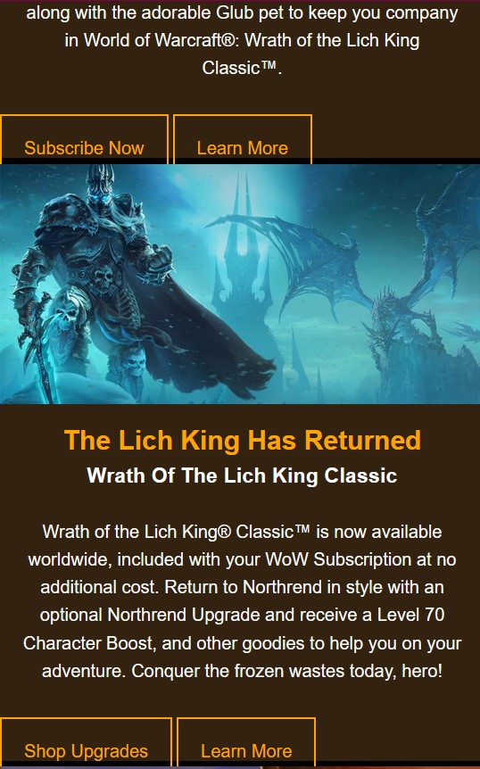
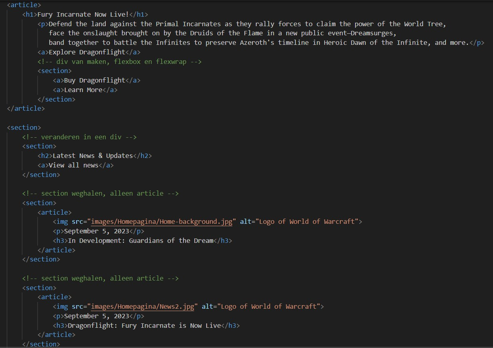

# Procesverslag
Markdown is een simpele manier om HTML te schrijven.  
Markdown cheat cheet: [Hulp bij het schrijven van Markdown](https://github.com/adam-p/markdown-here/wiki/Markdown-Cheatsheet).

Nb. De standaardstructuur en de spartaanse opmaak van de README.md zijn helemaal prima. Het gaat om de inhoud van je procesverslag. Besteedt de tijd voor pracht en praal aan je website.

Nb. Door *open* toe te voegen aan een *details* element kun je deze standaard open zetten. Fijn om dat steeds voor de relevante stuk(ken) te doen.

## Jij

  
uitwerken voor kick-off werkgroep

  ### Auteur:
  Amber Venema

  #### Je startniveau:
  Rode piste

  #### Je focus:
  Responsive
 

## Je website

  
uitwerken voor kick-off werkgroep

  ### Je opdracht:
  World of Warcraft website: https://worldofwarcraft.blizzard.com/en-us/

  Informatie website over de game World of Warcraft

  #### Screenshot(s) van de eerste pagina (small screen): 
  Homepagina
  https://worldofwarcraft.blizzard.com/en-us/ 

  

  #### Screenshot(s) van de tweede pagina (small screen):
  Dragonflight expansion
  https://dragonflight.blizzard.com/en-us/
  
  
 

## Toegankelijkheidstest 1/2 (week 1)

  
uitwerken na test in 2e werkgroep

  ### Bevindingen
  Lijst met je bevindingen die in de test naar voren kwamen:

  Ik had verwacht dat de webstie toegankelijk zou zijn en dat was het eigenlijk helemaal niet. Je kan niet inzoomen, er worden geen alt-teksten gebruikt, er is geen button om meteen naar de content toe te gaan en de screenreader slaat sommige elementen over en spreekt het niet correct uit. Terwijl er wel lang="en-US" staat, maar sommige woorden worden als nog half nederlands gesproken in een engels accent.
  Verder wordt er op de home pagina een video gebruikt met flitsende beelden. Je kan het ook totaal niet uitzetten.

  Visueel ziet de website er mooi uit, maar als je een beperking hebt, ga je veel moeite hebben met het begrijpen van deze website. Zoals dat er geen focus staat op de knoppen, dus dan weet de screenreader ook niet waar je heen gaat of waar je op staat.
  Of het lezen van tekst op een afbeelding of video. Het contrast ervan is erg slecht en het leid ook nog eens af. Als je slecht zient bent, kun je dat niet goed lezen en inzoomen kan niet.

  Zoals hier:

   

## Breakdownschets (week 1)

  
uitwerken na afloop 3e werkgroep

  De website bevat heel veel div's in elkaar. Dat heb ik nu niet allemaal genoteerd, want dan zou het helemaal vol zitten met aantekeningen. Voor mijn website wil ik minder sections gaan gebruiken. Minstens twee of drie in elkaar. 

  ### de hele pagina van Homepagina: 
  

   ### de hele pagina van Dragonflight: 
  

## Voortgang 1 (week 2)

  
uitwerken voor 1e voortgang

  ### Stand van zaken
  hier dit ging goed & dit was lastig (neem ook screenshots op van delen van je website en code)

  Ik heb een begin van de home pagina gemaakt, maar nog niet zoveel. In en buiten de les was ik vooral bezig met de opdrachten in de werkgroep. Daardoor ben ik wat later begonnen aan mijn webstie.

  Op het moment zit ik vast met de selectors. Ik heb een aantal sections gemaakt en het lukt mij niet om een bepaalde selector aan te roepen. Dan maakte ik gebruik van :nth-of-type() en werd er eigenlijk alleen de eerste section die er is. Of om de 2 sections.

  Hier is een voorbeeld:

  Twee section hebben dezelfde achtergrond foto, terwijl ik hier een pad heb gemaakt om ze uitelkaar te halen. Er moet iets zijn dat ik niet goed heb ingetikt, maar ik zie even niet wat.

  

  Dit is de html ervan. De section die ik probeer te pakken, is een section in een section in een section. 

  
  

  ### Agenda voor meeting
  samen met je groepje opstellen

  | Amber          | Elles              | Rhania       | Sophie           |
  | ---            | ---                | ---          | ---              |
  | Tekst schalen  | Tekst schalen      | Flexbox      | Flexbox          |
  | CSS Selectors  | Grid               |              | Responsive       |
  |                | Logo in het midden |              |                  |

  ### Verslag van meeting
  hier na afloop snel de uitkomsten van de meeting vastleggen

  - Sommige sections weghalen en/of veranderen in articles
  - Alt-teksten nog veranderen
  - CSS Selectors nu duidelijk en had het al bijna goed

  Het was een niet heel erg lang gesprek over deze feedback. Ik kreeg hulp bij de CSS Selectors, want ik had moeite met een bepaald element in een section pakken. Nou bleek het dat ik nadat ik :nth-of-type() gebruikte, de elementen erachter moest zetten. Dat werkte en ik begreep ook waarom, want computer denken van achter naar voor. Dus aan het einde begin je met het begin. 

  Daarna werd mij verteld dat ik wat sections weg kan halen, omdat ik er teveel had en het wat kon versimpelen. Verder was er een beetje een discussie over of ik ergens beter een article of section kon gebruiken. Dit is omdat daarin veel tekst stond en een plaatje, maar dan geen header had. Dus het was een beetje van beide wat wel lastig was.
  Ik weet dus niet zeker of wat ik nu heb eigenlijk goed is.

  Als laatste moest ik de alt-teksten nog even veranderen in iets wat de afbeelding goed beschrijft. 

## Voortgang 2 (week 3)

  
uitwerken voor 2e voortgang

  ### Stand van zaken
  hier dit ging goed & dit was lastig (neem ook screenshots op van delen van je website en code)

  De eerste website heb ik nu bijna helemaal klaar. Ik was nog even bezig met het hamburger menu en nog niet heel veel aan de tweede website gewerkt. Wel heb ik daarvan de html schrijven, maar ik wilde nog even zeker weten of ik section en article goed heb gebruikt.

    
    

  Verder lukt het mij niet om de knoppen gecentreerd te krijgen en goed in het vlak te positioneren. Ze zitten nu steeds tussen twee sections in.

  

  ### Agenda voor meeting
  samen met je groepje opstellen

  | Amber                     | Elles                 | Rhania                              | Sophie                              |
  | ---                       | ---                   | ---                                 | ---                                 |
  | Knoppen centreren         | Grid                  | Uitklapbaar menu over de pagina     | Uitklapbaar menu over de pagina     |
  | Sections goed gebruiken   | A href=""             | Responsive                          |                                     |
  |                           | Github link           |                                     |                                     |
  |                           | Section uitlijnen     |                                     |                                     |
  |                           | CSS pagina 2          |                                     |                                     |
  |                           | 1 Kolom met schalen   |                                     |                                     |

  ### Verslag van meeting
  hier na afloop snel de uitkomsten van de meeting vastleggen

  - Voor styling div's gebruiken
  - Nog aantal sections weghalen
  - Even wachten tot Github is geupdate (duurt eventjes)

  Het gaat al best goed met mijn website en er werd gezegd dat ik wat meer gebruik mocht maken van div's. Voor de styling dan vooral, waardoor het er netter uitziet. Ook de knoppen kon ik het beste in div's doen en dan flexwrap gebruiken. De knoppen moeten namelijk op mobiel onderelkaar en op tablet en computer naast elkaar.

  Ik had wat notities gemaakt in mijn code van wat ik ga veranderen en waar:

  

## Toegankelijkheidstest 2/2 (week 4)

  
uitwerken na test in 9e werkgroep

  ### Bevindingen
  Lijst met je bevindingen die in de test naar voren kwamen (geef ook aan wat er verbeterd is):

## Voortgang 3 (week 4)

  
uitwerken voor 3e voortgang

  ### Stand van zaken
  hier dit ging goed & dit was lastig (neem ook screenshots op van delen van je website en code)
  Ik ben nu al best ver met beide pagina's. Bijna klaar nu. Voor nu moet ik nog aan het menu werken, de carrousel van de dragonflight pagina en de website responsive maken.

   
   

  Hier moet ik dus nog even aan werken, maar ik heb dit gister met de docent besproken. Dus ik weet hoe ik dit moet afmaken.

  

  ### Agenda voor meeting
  samen met je groepje opstellen

  | Amber                              | Elles                 | Rhania                              | Sophie                              |
  | ---                                | ---                   | ---                                 | ---                                 |
  | Wanneer px of em gebruiken         | Responsive, margins   | Uitklapbaar menu over de pagina     | Uitklapbaar menu over de pagina     |
  | Captions en transcript toevoegen   | Media queries         | Responsive                          |                                     |
  | Achtergrond en tekst er overheen   | Sections en div's     |                                     |                                     |
  |                                    | Articles              |                                     |                                     |

  ### Verslag van meeting
  hier na afloop snel de uitkomsten van de meeting vastleggen

  - Pixels hoef ik eigenlijk niet echt te gebruiken. Voor hoogtes en breedtes kan ik het beste vw of vh gebruiken, want dit schaalt mee. En em voor tekst blijven gebruiken.
  - Qua captions kan ik het beste een YouTube link gebruiken, want daar staat het dan al bij. Er is niet echt code voor om die captions te laten verschijnen, dus dit is de beste mogelijkheid.
  - Voor de tekst op een afbeelding kan ik het beste een vlak achter de tekst maken om de tekst beter leesbaar te maken. Schaduw werkt niet genoeg en ik had ook al de achtergrond foto donkerder gemaakt, maar dat werkt dus niet genoeg. Nu ga ik dat proberen.

## Eindgesprek (week 5)

  
uitwerken voor eindgesprek

  ### Je uitkomst - karakteristiek screenshots:
  

  ### Dit ging goed/Heb ik geleerd: 
  Korte omschrijving met plaatjes

  

  ### Dit was lastig/Is niet gelukt:
  Korte omschrijving met plaatjes

  

## Bronnenlijst

  
continu bijhouden terwijl je werkt

  Nb. Wees specifiek ('css-tricks' als bron is bijv. niet specifiek genoeg). 
  Nb. ChatGpT en andere AI horen er ook bij.
  Nb. Vermeld de bronnen ook in je code.

  1. Responsive 2-buttons burger
  https://dlo.mijnhva.nl/content/enforced/536487-FDMCI-2000FED121-DMCI-CMD-2324/FED%2023-24%20-%20Blok%201%20-%20Oefening%20JS%203-stap.pdf
  2. De carrousel die ik op de Dragonflight pagina heb gemaakt, komt van de docent vandaan. Hij heeft mij uitgelegd hoe ik dat makkelijk kan maken met CSS. We hebben gebruik gemaakt van overflox-x scroll en flex-direction column en dan flex om alles naast elkaar te krijgen.
  3. Text-shadow
  https://codepen.io/shooft/pen/XWoJbov?editors=1100 

